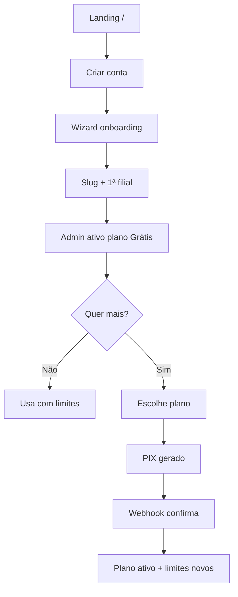

# Plano SaaS Self-Service — App Cardápio

Objetivo: transformar o produto de **onboarding manual pelo superadmin** em **SaaS self-service**, com **freemium**, upgrade por plano pago e **assinatura mensal via PIX online** (com confirmação automática por webhook).

---

## Situação atual

| Área | Hoje |
|------|------|
| Cadastro de restaurante | Superadmin em `/platform/tenants` |
| Planos | Um plano “Básico” no seeder; `features_json` + middleware `plan.feature` |
| Cobrança | `tenant_payments` registrados **manualmente** pelo superadmin |
| Inadimplência | `payment_status` `pending`/`overdue` bloqueia cardápio público (`EnsureTenantIsActive`) |
| Limites | `max_branches` existe no JSON mas **não é aplicado** em código |
| Home | `/` redireciona para login da plataforma |

**Conclusão:** a base de dados e o middleware de plano já existem; falta o funil público, billing automatizado e enforcement de quotas do freemium.

---

## Visão do produto (freemium → pago)

### Planos sugeridos

| Plano | Preço | Público |
|-------|-------|---------|
| **Grátis** | R$ 0 | Testar, 1 filial, volume baixo |
| **Starter** | ~R$ 49–79/mês | 1–2 filiais, cardápio + pedidos |
| **Pro** | ~R$ 99–149/mês | KDS, PDV, relatórios, webhooks |
| **Business** | sob consulta / custom | Múltiplas filiais, suporte prioritário |

### Limites no `features_json` (exemplo)

```json
{
  "max_branches": 1,
  "max_products": 30,
  "max_orders_per_month": 100,
  "max_admin_users": 2,
  "kds": false,
  "pos": false,
  "reports": false,
  "delivery_webhooks": false,
  "custom_domain": false
}
```

| Recurso | Grátis | Starter | Pro |
|---------|--------|---------|-----|
| Filiais | 1 | 2 | 5+ |
| Produtos | 30 | 150 | ilimitado |
| Pedidos/mês | 100 | 500 | ilimitado |
| KDS / PDV / Relatórios | não | parcial | sim |
| Webhooks entrega | não | não | sim |
| Marca “Powered by” | sim | opcional | não |

### Regras de freemium

1. **Cadastro sem cartão** — conta + tenant criados na hora; plano `gratis` ativo.
2. **Trial opcional** — 14 dias de recursos Pro ao criar conta (flag `trial_ends_at` na subscription).
3. **Soft limits** — aviso no admin ao atingir 80% do limite; bloqueio ao exceder (HTTP 403 ou banner).
4. **Hard limit pedidos** — após `max_orders_per_month`, cardápio continua visível mas checkout retorna mensagem “limite do plano”.
5. **Upgrade** — fluxo in-app; downgrade no fim do período já pago.

---

## Jornada self-service (funil)



### URLs novas (proposta)

| Rota | Descrição |
|------|-----------|
| `/` | Landing marketing + CTA “Começar grátis” |
| `/cadastro` | Registro do **dono** (não cliente final) |
| `/cadastro/continuar` | Wizard: nome restaurante, slug, filial |
| `/planos` | Tabela comparativa (pública) |
| `/{slug}/admin/assinatura` | Plano atual, uso, upgrade, histórico PIX |
| `/webhooks/billing/{provider}` | Confirmação PIX (sem auth; HMAC/secret) |

O cadastro de **cliente final** (`/conta`) permanece separado do cadastro de **tenant**.

---

## Modelo de dados (evolução)

### `plans` — novos campos

- `sort_order`, `is_public`, `is_free`
- `description`, `highlights_json` (bullets para landing)
- Manter `features_json` como fonte de limites

### `tenant_subscriptions` — novos campos

- `billing_provider` (`asaas`, `efi`, `mercadopago`, …)
- `external_subscription_id`, `external_customer_id`
- `trial_ends_at`, `cancel_at_period_end`, `canceled_at`
- `payment_method` (`pix`, `manual`)

### `subscription_invoices` (nova tabela)

Cobrança recorrente automatizada (diferente de `tenant_payments` manual legado):

| Campo | Uso |
|-------|-----|
| `tenant_id`, `subscription_id` | vínculo |
| `amount`, `due_date`, `status` | `pending`, `paid`, `expired`, `canceled` |
| `pix_qr_code`, `pix_copy_paste`, `pix_expires_at` | exibição no admin |
| `external_id`, `paid_at` | reconciliação webhook |
| `period_start`, `period_end` | ciclo mensal |

`tenant_payments` pode permanecer para ajustes manuais do superadmin ou migrar gradualmente para invoices.

### `tenant_usage_counters` (nova tabela, opcional)

- `tenant_id`, `period` (YYYY-MM), `orders_count`, `products_count`
- Atualizado por jobs/eventos; evita `COUNT(*)` pesado em cada request

### `platform_settings` (nova tabela ou config)

- Chaves PIX do **SaaS** (não do restaurante): API keys criptografadas
- Webhook secrets por provider

---

## Pagamento PIX da assinatura (SaaS)

### Provider recomendado (Brasil)

| Provider | Prós | Contras |
|----------|------|---------|
| **Asaas** | API simples, PIX + assinatura recorrente, webhooks | Taxa por transação |
| **Efi (Gerencianet)** | PIX nativo forte | Integração um pouco mais verbosa |
| **Mercado Pago** | Conhecido | Assinatura menos “SaaS-first” |

**Recomendação inicial:** Asaas ou Efi — ambos suportam cobrança PIX com QR + webhook de `paid`.

### Fluxo técnico

1. Tenant escolhe plano em `/{slug}/admin/assinatura`.
2. Backend cria `subscription_invoice` + chama API do provider (valor = `plan.price_monthly`, vencimento = hoje + 3 dias).
3. Frontend exibe QR Code + “copia e cola” + timer de expiração.
4. Provider envia webhook → `BillingWebhookController` valida assinatura → marca invoice `paid` → atualiza `tenant_subscriptions` (`payment_status: paid`, renova `current_period_*`, troca `plan_id` se upgrade).
5. Job diário: invoices `pending` vencidas → `expired` → `payment_status: overdue` → grace period (ex. 3 dias) → suspende cardápio público.

### Segurança webhook

- Validar `X-Signature` / HMAC do provider
- Idempotência: `processed_webhook_events` (external_id único)
- Nunca confiar só no redirect do usuário

### Ambiente

```env
BILLING_PROVIDER=asaas
BILLING_API_KEY=
BILLING_WEBHOOK_SECRET=
BILLING_SANDBOX=true
```

---

## Enforcement de limites (código)

### Novo: `TenantPlanLimits` + middleware `plan.limit`

| Limite | Onde checar |
|--------|-------------|
| `max_branches` | `BranchController@store` |
| `max_products` | `ProductController@store` |
| `max_orders_per_month` | `CheckoutController`, `PosController` |
| `max_admin_users` | `UserController@store` |
| Features booleanas | Já existe `plan.feature:*` |

### Painel de uso

Em `admin/assinatura`: barras de progresso (pedidos/mês, produtos, filiais) + CTA upgrade.

### Freemium e superadmin

- Superadmin continua ignorando limites (`is_platform_user`)
- Tenant em plano grátis: `payment_status` pode ser `free` (não bloqueia cardápio)

---

## Área do restaurante: assinatura

### Página `Admin/Subscription/Index.vue`

- Plano atual, próximo vencimento, status
- Uso vs limites
- Botões: **Fazer upgrade**, **Renovar PIX**, **Cancelar ao fim do período**
- Histórico de faturas (PIX pagos/expirados)

### Notificações

- E-mail: PIX gerado, PIX pago, vence em 3 dias, suspenso por inadimplência
- (Futuro) WhatsApp transacional

---

## Plataforma (`/platform`)

Manter para operações internas, mas deixar de ser o caminho principal:

| Ação | Self-service | Plataforma |
|------|--------------|------------|
| Criar tenant | `/cadastro` | Manual (suporte) |
| Registrar pagamento | Webhook PIX | Manual (exceção) |
| Suspender abuso | — | Sim |
| Ajustar plano | — | Sim (cortesia) |

---

## Landing e marketing

### `/` (nova home)

- Proposta de valor, comparativo de planos, FAQ
- CTA: “Criar cardápio grátis”
- Depoimentos / logos (futuro)
- SEO: `sitemap`, meta por página

### Legal (obrigatório para SaaS)

- Termos de uso, política de privacidade (LGPD)
- Checkbox no cadastro
- DPA se B2B

---

## Fases de implementação

### Fase 1 — Fundação freemium (sem PIX ainda)

- [ ] Seed planos: `gratis`, `starter`, `pro`
- [ ] `TenantPlanLimits` + enforcement `max_*`
- [ ] `payment_status: free` para plano grátis (não suspender cardápio)
- [ ] Página pública `/planos`
- [ ] Rotas `/cadastro` + wizard cria `User` + `Tenant` + `TenantSubscription` (plano grátis)
- [ ] Landing `/` substituindo redirect para login
- [ ] `admin/assinatura` (somente leitura: plano + uso)

**Entregável:** qualquer pessoa cria restaurante grátis sem falar com vocês.

### Fase 2 — PIX assinatura

- [ ] Migration `subscription_invoices` + campos em `tenant_subscriptions`
- [ ] `BillingService` + adapter Asaas/Efi
- [ ] `BillingWebhookController`
- [ ] UI: gerar PIX, QR, polling status (ou SSE)
- [ ] Job renovação mensal + grace period + overdue
- [ ] E-mails de billing

**Entregável:** upgrade e renovação 100% automáticos via PIX.

### Fase 3 — Growth e retenção

- [ ] Trial 14 dias Pro no signup
- [ ] Cupom de desconto na assinatura (platform)
- [ ] Métricas: MRR, churn, conversão free→paid (`platform/dashboard`)
- [ ] Remover “Powered by” no Pro
- [ ] Domínio customizado (Business)

### Fase 4 — Pagamento dos **pedidos** do restaurante (escopo separado)

Não confundir com billing SaaS:

- PIX/cartão no checkout do **cliente final** do restaurante
- Tabela `order_payments` já existe
- Provider pode ser o mesmo (Asaas) mas conta **do tenant**, não da plataforma

---

## Integração com backlog anterior

| Item antigo | Relação com SaaS |
|-------------|------------------|
| Webhooks entrega (tenant) | Feature **Pro**; token na UI |
| Pagamento online pedidos | Fase 4; independente da assinatura |
| Múltiplos planos | Este documento |
| Testes Breeze | Limpar antes de CI do SaaS |

---

## Métricas de sucesso

- **Time-to-value:** cadastro → cardápio publicado em &lt; 10 min
- **Conversão free→paid:** meta inicial 5–10% em 30 dias
- **Churn mensal:** &lt; 5%
- **Suporte manual:** &lt; 20% dos novos tenants precisam de intervenção humana

---

## Decisões em aberto (validar com produto)

1. **Provider PIX:** Asaas vs Efi vs Mercado Pago?
2. **Trial:** 14 dias Pro automático ou só plano grátis até upgrade?
3. **Grace period:** 3 ou 7 dias após vencimento antes de suspender?
4. **Slug:** reservar lista maior (`cadastro`, `planos`, `api`, …) em `web.php`
5. **CNPJ obrigatório** no cadastro ou só no upgrade pago (emissão NF)?

---

## Referências no código atual

- Planos: `app/Models/Plan.php`, `database/seeders/PlatformSeeder.php`
- Features: `app/Support/TenantPlanFeatures.php`, `EnsurePlanFeature`
- Bloqueio assinatura: `app/Http/Middleware/EnsureTenantIsActive.php`
- Pagamento manual: `app/Http/Controllers/Platform/TenantPaymentController.php`

---

*Última atualização: 2026-05-28*
